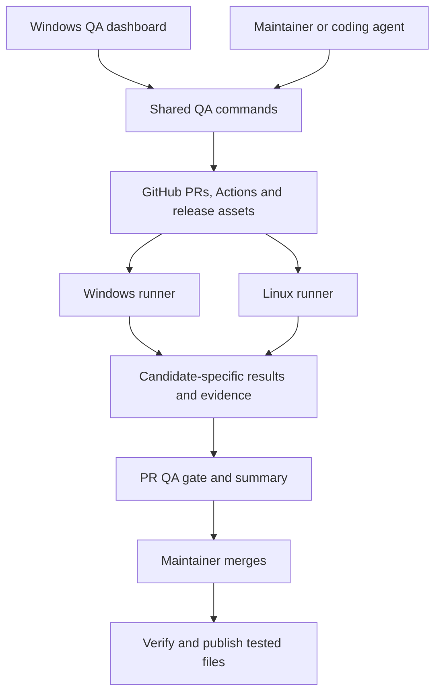

# Release QA design

Status: ready for maintainer review. This document records the planning conversation; it does not authorize implementation or a production release.

Date: 2026-09-20.

Related document: [implementation plan](../plans/2026-09-20-release-qa.md).

## Purpose

Build a reusable desktop QA application and CLI for maintainers and coding agents. They verify packaged release candidates, share automated and manual test results through GitHub, and publish the exact files that passed QA.

Dot X is the first real consumer. A small independent Tauri application proves that the tool does not require Dot X. The reusable tool belongs in its own repository, `Frogbyte-io/release-qa`. These planning documents were moved here from the Dot X planning worktree.

The first useful Dot X flow is installation, launch, creation of an audio session, mapping that session, independent verification of volume changes, restart, and persistence verification. A complete report and cleanup are part of that deliverable.

## Agreed decisions

| Area | Decision |
| --- | --- |
| Users | Maintainers and coding agents |
| Repository ownership | Separate QA tool; project-specific TypeScript scenarios stay in each project's `qa/` directory |
| Dot X layout | Preserve the current layout; no preliminary monorepo migration |
| Execution | Shared runner for the UI, CLI, and CI; deterministic assertions do not require an AI agent |
| Platforms | Windows and Linux runners in the first usable version; Windows dashboard first |
| Linux baseline | Pin one Ubuntu LTS environment; start with a virtual display; describe real desktop coverage separately |
| Test machines | Dedicated test account/machine or disposable VM, never routine installation testing in an everyday profile |
| Hardware | No hardware required for the automated baseline; required hardware checks block release until completed or excepted |
| Authentication | GitHub CLI required initially; no separately registered GitHub App or hosted backend |
| Shared records | GitHub PRs, Actions, and release assets; local cache and unsynced work on each tester's machine |
| Release preparation | Fast tests on every push; an explicit Prepare candidate operation builds signed distributables |
| Automatic execution | Prepared candidates automatically start suites needing neither a person nor exclusive hardware |
| PR management | Feature/issue list, editable changelog, and a managed QA summary; required check controls merge readiness |
| Publication approval | A maintainer merges the release PR; merging authorizes publication after final validation |
| Source stability | Brief target-branch freeze during final QA; any changed tested source requires a new candidate |
| Result policy | Required checks must pass; explicit maintainer exceptions remain visible and distinguishable from passing QA |
| Team handoff | Completed independent scenarios carry forward for the same candidate; unfinished stateful scenarios restart |
| Ownership | Advisory ownership and duplicate-work warnings initially; no claim of distributed locking |
| Release notes | Changelog section plus a short QA summary by default; configurable template, including an explicit whole-body option |
| Infrastructure | Prepared Windows/Linux machines first; Fleet Manager provisions environments in a later stage |

## Proposed technical defaults for review

These are implementation proposals, not decisions already made by the maintainer.

- Working product name: Release QA. Working CLI name: `release-qa`. Choose repository/package names before publishing anything externally.
- Dashboard: Electron, Vue 3, TypeScript. The Node-based runner and `gh` integration make this a small additional shell. Keep a narrow IPC interface, context isolation, and no Node access in the renderer.
- Runner: TypeScript on Node.js 22 or newer, with a supported runtime pinned in CI and the lockfile when implementation begins.
- Test libraries: Vitest for tool logic; WebdriverIO as the leading Tauri native automation candidate. Prefer its external driver route when testing unchanged release packages. Compare Playwright over WebView2 on Windows if necessary.
- Linux baseline: Ubuntu 24.04 x86_64 with Xvfb for the first sample-app test. This is one environment, not a claim of compatibility with all Linux distributions.
- Packaging: distribute a Windows dashboard and documented Windows/Linux CLI installation. Linux dashboard packaging and other application frameworks are later scope.

Stage 0 must settle the driver using packaged binaries. If release-mode automation requires a different build, record that limitation and revise the design before calling those tests release verification. Do not silently add an embedded test server to a shipping app.

## Architecture and ownership



The tool owns execution, result schemas, reports, candidate identity, GitHub integration, and UI. Consumer repositories own executable scenarios, lifecycle hooks, platform fixtures, required suites, and release policy. The driver automates application windows; OS helpers independently inspect side effects.

Fleet Manager eventually owns acquiring, resetting, and releasing machines and hardware. It must invoke the same runner. Fleet is not a prerequisite for the first release and does not decide test outcomes.

Keep the initial tool repository small:

```text
apps/desktop/                  Electron main/preload and Vue UI
packages/qa/src/model/         Versioned manifests and report validation
packages/qa/src/runner/        Lifecycle, process tracking, checkpoints
packages/qa/src/drivers/       Native automation adapter
packages/qa/src/github/        gh transport, storage, summaries, publication
packages/qa/src/cli/           Commands and machine-readable output
packages/qa/test/              Contract, integration and fault tests
examples/tauri-smoke/          Independent packaged consumer
.github/workflows/            Tool CI and reusable consumer workflows
docs/                         Setup, test-authoring and operations guides
```

Use one shared TypeScript package initially. Split packages only when consumers need independently versioned interfaces. The dashboard invokes shared commands; it must not implement a second evaluator.

## Consumer contract

Each consumer provides `qa/project.json`, a pinned QA tool dependency, TypeScript scenarios, and lifecycle hooks. Discovery reads JSON without executing project code. Execution requires an explicitly trusted consumer checkout at the candidate's test revision.

The configuration defines project ID, schema version, intended release branch, suite IDs, supported platform/environment profiles, scenario files, lifecycle module, release workflow IDs, and generated PR marker names. Repository labels/topics assist discovery; they are not the authority for bypassing QA.

Scenarios have stable IDs, titles, feature/issue references, execution mode, required capabilities, and acceptance criteria. They use the established driver's assertion and waiting facilities. Add only the metadata and manual-checkpoint integration required for release QA; do not build a visual workflow language or a new assertion engine.

Lifecycle hooks implement install, launch, reset between independent scenarios, and cleanup. They receive the candidate artifact path, designated test root, environment profile and cancellation signal. They return handles only for processes/resources created by that run. Hooks are repository code with real OS effects; the dashboard cannot silently execute a discovered repository merely by displaying it.

Proposed CLI operations are `doctor`, `repos`, `releases`, `prepare`, `run`, `resume`, `sync`, `status`, `gate`, and `merge`. All support structured JSON output where applicable. Scenario failures, unavailable prerequisites, and infrastructure errors have distinct report values and nonzero exit statuses. Document exact flags when Stage 1 introduces each command.

## Identity and evidence

| Record | Required identity and contents |
| --- | --- |
| Release | Repository ID, PR number, intended version, draft release ID |
| Candidate | Unique ID, source head SHA, base SHA, source tree SHA, test revision, suite/policy digest, build workflow/run/attempt, required platform artifacts |
| Artifact | Platform, architecture, format, filename, GitHub asset/artifact IDs, SHA-256 of distributable bytes |
| Run | Unique ID, candidate ID, environment profile, measured capabilities, runner/tool version, GitHub actor, scenario attempts and evidence references |
| Manual result | Scenario/checkpoint ID, observed result, evidence or required notes, reporting actor, candidate and environment |
| Exception | Candidate, requirement IDs, reason, authorized maintainer identity and time; never inferred from a ticked PR checkbox |
| Approval snapshot | Candidate and accepted run IDs, requirements digest, exception IDs, merged PR/head identity, final report digest |

Hash the installer and updater files, not only the Actions artifact archive. A rebuild at the same source SHA is a new candidate. Do not identify a download through a branch name, filename, or latest successful workflow alone.

Local timestamps do not decide which report wins. Upload separate records with stable IDs and explicit predecessor/attempt relationships. Retrying the same upload is idempotent; reusing an ID with different content is an error. Validate record size and schema before aggregation. Evidence can be public, but uploads must exclude credentials and personal machine data.

## Storage and synchronization

1. Source Git stores test code, configuration, and release requirements. Routine result uploads do not create source commits.
2. Actions provides build provenance and temporary artifacts.
3. Draft release assets hold exact candidate packages, separate checkpoint/result records, and evidence. A GitHub-side coordinator selects the active candidate and generates summaries.
4. The PR body is a view. HTML comments delimit managed sections and contain small identifiers only. They are not secret storage or the authoritative result database.
5. Each tester has a local cache and durable upload queue. Show unsynced results explicitly; they cannot satisfy the shared gate.

Only the coordinator edits the shared QA summary and active-candidate selection. Reports from multiple machines are separate uploads. Reconciliation refetches all records, so a missed notification can be repaired by Sync/Reevaluate. Do not rely on every GitHub concurrency-group event running, since pending jobs can be replaced.

Store superseded candidate manifests and result history. Before publication, remove superseded installable packages from the final download list; retain their provenance and reports. Only approved binaries are presented as release downloads. Final summaries refer to evidence files attached before release immutability takes effect. Later regression testing cannot rewrite the original release approval.

No hosted database is required for this scale. The tool does not promise instantaneous synchronization, atomic multi-user locks, or arbitrary live machine-state transfer.

## Execution and handoff

Capture prerequisites before installation: OS/version/architecture, desktop session, audio facilities, disk space, driver/runtime availability, and hardware ownership as applicable. Missing required capability is blocked, not passed or implicitly not applicable.

Run unattended baseline suites without hardware. A Linux virtual display supports application-window tests; it does not establish real Wayland, tray, audio-device, suspend/resume, or physical device behavior. A self-hosted desktop run must use the intended user's GUI/session environment, not assume a background service has one.

Shared steps may call platform-specific fixtures. Report platform coverage separately even when scenario intent is identical. Do not use a Linux sample-app pass as evidence that Dot X supports Linux.

Upload completed checkpoints and scenario results. Another tester can continue the remaining independent scenarios for the same candidate. An unfinished stateful scenario restarts setup on another machine. A stale ownership claim is advisory and visibly reclaimable; both overlapping attempts remain in history. A required failing attempt cannot disappear merely because a different machine later passes. The evaluator requires an explicit retry relationship and preserves contradictory results for triage.

Cancellation, timeout and crash must trigger bounded cleanup of owned resources. Persist enough run state to report interruption after restart. Cleanup failure remains visible and prevents reuse of a dirty environment until reset. Never kill an application by a process name shared with a production installation.

## Release lifecycle

1. A maintainer creates a release PR with version changes, proposed feature/issue list and changelog. Scope comes from merged work since the previous release, with human correction. Issue references do not imply test coverage.
2. Fast source checks run on pushes. A new head immediately makes older candidate results ineligible for that PR revision.
3. Prepare candidate first makes the gate blocking, then builds and signs the intended final version. It records provenance, stages files on a draft release, and selects that candidate through the coordinator. A failed preparation cannot restore a previous green approval by accident.
4. Automatically run suites needing no operator or exclusive device. Maintainers start desktop/hardware suites through the UI or CLI. Results must match the selected candidate and exact requirement set.
5. The QA gate computes readiness, including platform/environment requirements. Missing, failed, blocked, cancelled or unsynced required checks block. An authorized exception can produce `approved-with-exceptions`, with a success check explicitly titled that way.
6. Freeze the target branch during final QA. Push fixes to the same release PR and explicitly prepare a new candidate. Reevaluate every required check for the new candidate.
7. A maintainer merges the exact reviewed head. The app uses a head-match condition and does not bypass rules. Normal GitHub merging remains supported when rules are satisfied.
8. Publication reloads the authoritative records. Require the merged tree to equal the tested source tree, verify artifact hashes and signatures, verify the current requirements and exception authority, and record the merge/head relationship. The tested head and merge commit need not have the same SHA; the manifest must distinguish them.
9. Create the final version tag at the verified merged source, attach the final QA record, set the reviewed release notes, and publish the same distributable files. No rebuild, version rewrite, or re-signing occurs after QA.
10. Retry partial publication idempotently. Existing correct assets/tags are reused; mismatching ones stop the job. Display merged-but-publication-failed separately from published.

The final version number is embedded before candidate testing. Candidate IDs distinguish iterations without changing a tested prerelease version into a different final binary.

## GitHub gate and permissions

Use `gh` authentication for desktop/CLI operations; do not expose tokens to the renderer or process arguments. Display the active account and actual repository capabilities. Read, report, workflow execution, release editing, and merge permissions are distinct. Version one assumes authorized maintainer/tester accounts with the permissions needed for their selected actions.

Repository Actions supplies the trusted evaluator using its scoped workflow token. Default CLI OAuth credentials do not need to create Check Runs directly. The PR-originated gate checks external reports and can be rerun after synchronization. A manually dispatched preparation/execution job is not itself the PR merge gate.

The gate should evaluate promptly and exit. It must not keep a billed Actions worker alive while waiting hours or days for manual checks. Result synchronization requests a new evaluation, while the app displays remaining manual work from shared records.

Stage 0 must prove the exact head/test-merge association, latest-head invalidation, same-head candidate replacement, reevaluation, and default-branch workflow requirements. A rerun preserves the original event SHA; do not rerun an obsolete gate and present it as current. GitHub also limits normal workflow reruns to 30 days, so the integration must refresh old PR evaluations through an eligible event rather than requiring an unrelated source change.

Protect the target branch with a stable gate name, trusted source, and appropriate review requirements. Evaluate release intent from configured branch/version metadata as well as labels, so deleting a label cannot bypass QA. The always-running evaluator must never mark missing manual work `neutral` or `skipped`. Evaluate non-release PRs explicitly under the repository's normal policy.

Publication independently validates readiness even if someone bypasses branch rules. Administrative write access to GitHub is not an adversarial trust boundary this tool can eliminate. Treat scenario/report text as data in privileged summary/publication jobs; do not run arbitrary PR code with release credentials. Execute only selected trusted release candidates on dedicated self-hosted machines.

## PR and dashboard behavior

The dashboard lists opted-in repositories, upcoming release PRs, selected candidates, required checks, history and published releases. Discovery is paginated and cached, with a manual repository URL option. Old releases without reports show `no recorded QA`.

The release view offers Prepare candidate, Run suite, Record manual result, Resume, Sync, Open PR and Merge. Disable unavailable operations with an explanation based on permissions or prerequisites. Execution and gate decisions use the shared package, not renderer logic. Remote jobs continue after the dashboard closes.

Use `<!-- release-notes:start -->` and `<!-- release-notes:end -->` for editable release notes, and `<!-- qa:start -->` / `<!-- qa:end -->` for generated QA output. Preserve all other text and the consumer's PR template rules. Duplicate or malformed markers produce a repairable error rather than replacing the entire body.

Freeze the chosen changelog text when merging and use that snapshot for publication. Prose edits alone do not invalidate binary tests. Changes to requirements, test code or candidate identity require reevaluation or a fresh candidate. If configuration explicitly selects the whole PR body for release notes, show a preview and retain the maintainer's chosen scope.

## Dot X adoption and limits

Inspected planning checkout: branch `t3code/kitchen-app-test-plan`, commit `4f5645b4dce1e9fcc4170aae7a53bb0d4c5df025`.

- `package.json` has build/typecheck commands but no frontend test runner.
- `.github/workflows/ci.yml` runs frontend/SDK checks on Ubuntu and native Rust tests on Windows. This checkout has no application packaging/publication workflow.
- `src-tauri/tauri.conf.json` shares `com.dot-x.dev` between dev and installed builds. Dedicated test machines preserve the actual release identity without touching the maintainer's profile.
- `src/App.vue` starts integrations, plugin state and configured device connections. App launch is a real integration action.
- This checkout has unconditional Windows native dependencies. Separate Linux work was observed but was not verified as integrated. Require an actual Linux release candidate before enabling native Dot X Linux requirements.
- The updater endpoint is Anystack. Aptabase is analytics. Moving updates to GitHub is a separate adoption task and must not change telemetry as a side effect.

First Dot X assertions cover session discovery, add/change/remove mapping, controlled slider input, independent OS volume readback, restart persistence, and cleanup. Controlled input must use an existing production entry point or external fixture. If no such input exists without hardware, Stage 0 must identify that constraint; it cannot replace the real path with a mock and call the full scenario proven.

Later suites cover plugin lifecycle, close-to-tray behavior, device reconnect, MIDI, brightness, failure reporting, upgrade compatibility and settings migration. Use physical checks where the observable result cannot be established automatically with available instruments. Keep an explicit entry-point/layer/plugin/reverse-state/docs coverage inventory for Dot X changes.

## Success criteria

- One reusable CLI runs the independent Tauri sample on Windows and Ubuntu and produces the same report schema.
- Dot X's first Windows release flow proves real OS behavior and persistence against the packaged candidate.
- Two testers contribute results without overwriting each other; a third can reconstruct progress from GitHub.
- Missing manual work, stale candidates, hash mismatch, unauthorized exceptions and failed cleanup cannot produce an unqualified passing result.
- A release PR cannot merge under configured rules until its QA policy is satisfied, with visible exceptions where approved.
- Publication uses the exact approved bytes and survives a retry without creating a different release.
- The Windows dashboard and an agent's CLI produce equivalent decisions.

## Deferred scope

Hosted database, independent OAuth login, Linux dashboard, macOS, visual flow editor, arbitrary mid-scenario migration, strict distributed leases, general Electron application testing, and Fleet Manager integration are separate increments. Their absence must not prevent the first Windows/Linux runner and release PR workflow from working.

## Research references

Checked during planning on 2026-09-19/20. Verify exact library versions and GitHub behavior in Stage 0 rather than treating documentation as runtime proof.

- [Tauri native automation](https://v2.tauri.app/develop/tests/webdriver/) and [Linux virtual-display CI](https://v2.tauri.app/develop/tests/webdriver/ci/).
- [Playwright WebView2](https://playwright.dev/docs/webview2).
- [Electron security guidance](https://www.electronjs.org/docs/latest/tutorial/security).
- [GitHub required-check semantics](https://docs.github.com/en/pull-requests/how-tos/merge-and-close-pull-requests/troubleshooting-required-status-checks).
- [Workflow reruns](https://docs.github.com/en/actions/how-tos/manage-workflow-runs/re-run-workflows-and-jobs).
- [Actions artifact identity](https://docs.github.com/en/rest/actions/artifacts) and [artifact retention](https://docs.github.com/en/actions/how-tos/manage-workflow-runs/remove-workflow-artifacts).
- [Immutable releases](https://docs.github.com/en/code-security/concepts/supply-chain-security/immutable-releases).
- [GitHub CLI authentication](https://cli.github.com/manual/gh_auth_login) and [head-matched merge](https://cli.github.com/manual/gh_pr_merge).
- [Self-hosted runners](https://docs.github.com/en/actions/how-tos/manage-runners/self-hosted-runners).
- [Fleet Lab architecture](https://github.com/Frogbyte-io/fleet-manager/blob/main/docs/architecture/lab.md), proposed infrastructure integration rather than an available prerequisite.
